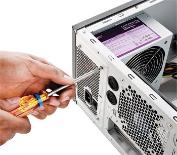
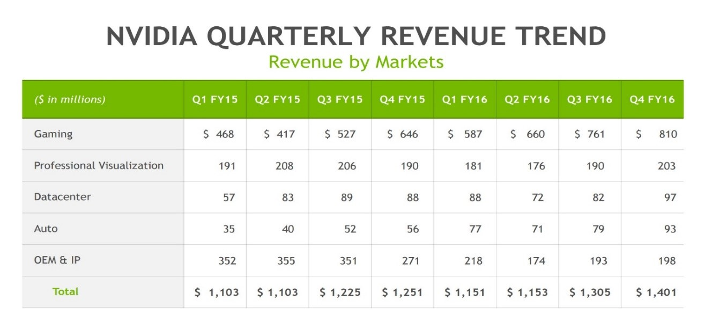
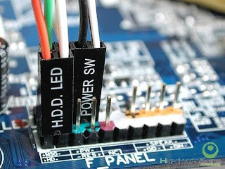
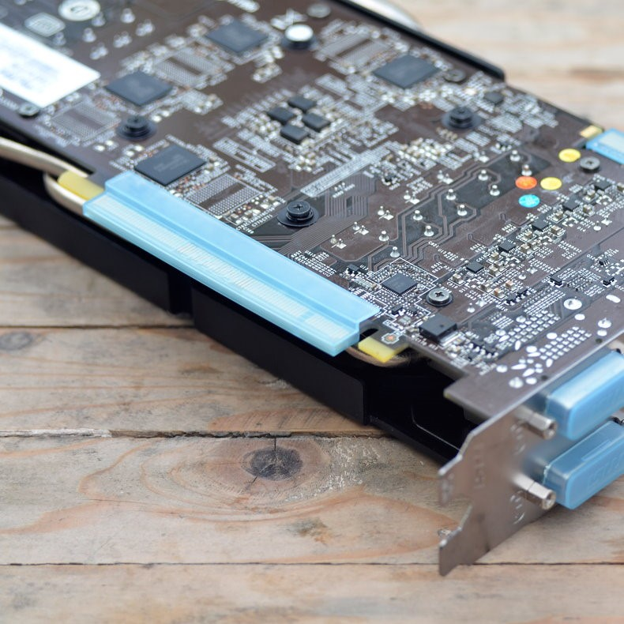
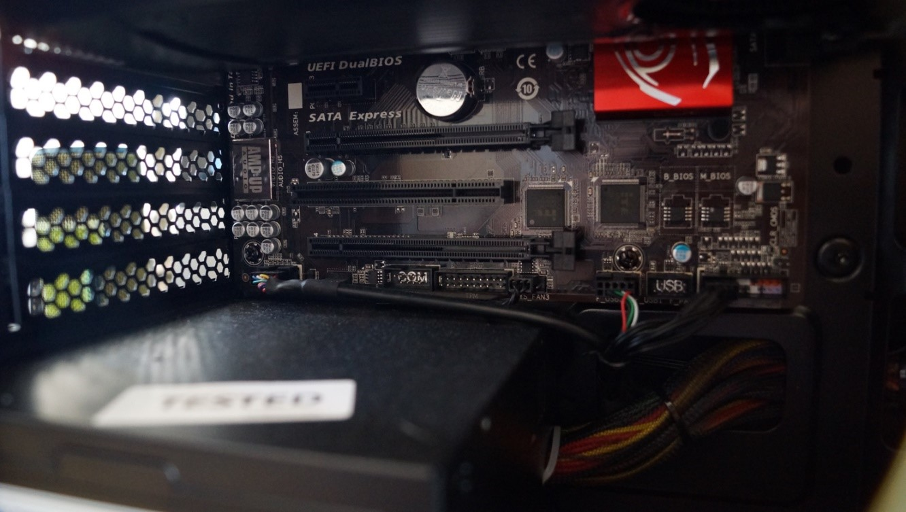

.. |ATXpicture| image:: images/ATXpicture.jpg
    :alt: A demonstrative picture of a motherboard, showing the thre standard sizes of motherboards, from ATX, microATX, and m-ITX
    :scale: 50 %
    
.. |TEST| replace:: Soup

.. |CPUpicture| image:: images/CPUpicture.jpg
    :alt: Picture of a CPU, along with three corners highlighted to demonstrate correct orientation.
    :scale: 50 %
    
.. |RAMpicture| image:: images/RAMpicture.jpg
    :alt:
    :scale: 50 %
    

    

    

    
.. |HDDpicture| image:: images/HDDpicture.jpg
    :alt:
    :scale: 50 %
