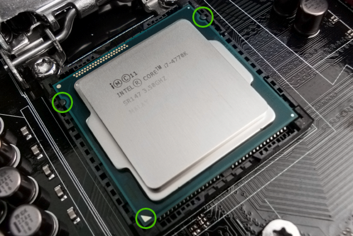
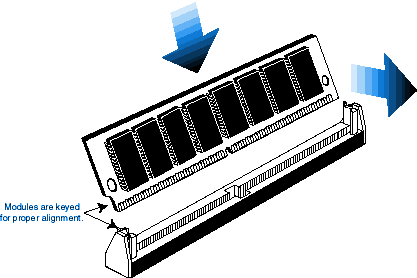
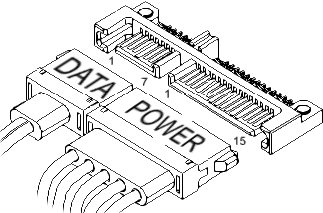

.. |ATXpicture| image:: images/ATXpicture.jpg
    :alt: A demonstrative picture of a motherboard, showing the thre standard sizes of motherboards, from ATX, microATX, and m-ITX
    :scale: 50 %
    
.. |TEST| replace:: Soup

.. |PSUpicture| image:: images/PSUpicture.jpg
    :alt: A demonstrative picture of screwing a PSU into place.
    :scale: 50 %

.. |NvidiaGraph| image:: images/NvidiaGraph.jpg
    :alt: Quartly reports of Nvidia's financial trends and gains.
    :scale: 50 %

    

    
.. |IOpicture| image:: images/IOpicture.jpg
    :alt: Picture showing three power plugs plugged into the IO panel, reading "H.D.D LED" and "POWER SW".
    :scale: 50 %
    
.. |GPUpicture| image:: images/GPUpicture.jpg
    :alt: Picture of the underside of a GPU, along with the protective plastic cap over the golden pins.
    :scale: 50 %
    
.. |PCIEpicture| image:: images/PCIEpicture.jpg
    :alt: Picture of multiple PCIE slots within a computer.
    :scale: 50 %
    

