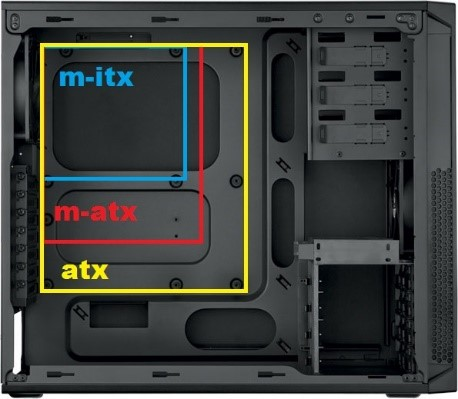

    
.. |TEST| replace:: Soup

.. |NvidiaGraph| image:: images/NvidiaGraph.jpg
    :alt: Quartly reports of Nvidia's financial trends and gains.
    :scale: 50 %

.. |CPUpicture| image:: images/CPUpicture.jpg
    :alt: Picture of a CPU, along with three corners highlighted to demonstrate correct orientation.
    :scale: 50 %
    
.. |RAMpicture| image:: images/RAMpicture.jpg
    :alt:
    :scale: 50 %
    

    
.. |GPUpicture| image:: images/GPUpicture.jpg
    :alt:
    :scale: 50 %
    
.. |PCIEpicture| image:: images/PCIEpicture.jpg
    :alt:
    :scale: 50 %
    
.. |HDDpicture| image:: images/HDDpicture.jpg
    :alt:
    :scale: 50 %
